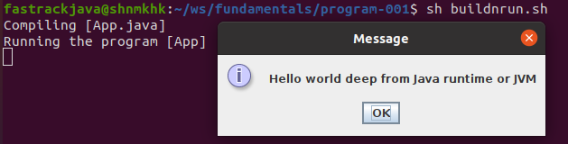

### This is first program in Java fundamentals.

*Prerequisites:*

JDK latest version is installed on current machine (JDK 8+ when writing this program)
from https://www.oracle.com/java/technologies/javase-downloads.html

#### On Windows:
   > Open Command Prompt and change to this directory
     Eg: C:\Users\fastrackjava\ws\fundamentals\program-001
   
   > Type *buildnrun.cmd* and hit enter

#### On Unix/ Linux/ Mac:
   > Open terminal/ shell and change to this directory
     Eg: /Users/fastrackjava/ws/fundamentals/program-001
     
   > Type *./buildnrun.sh* and hit enter

   > 

